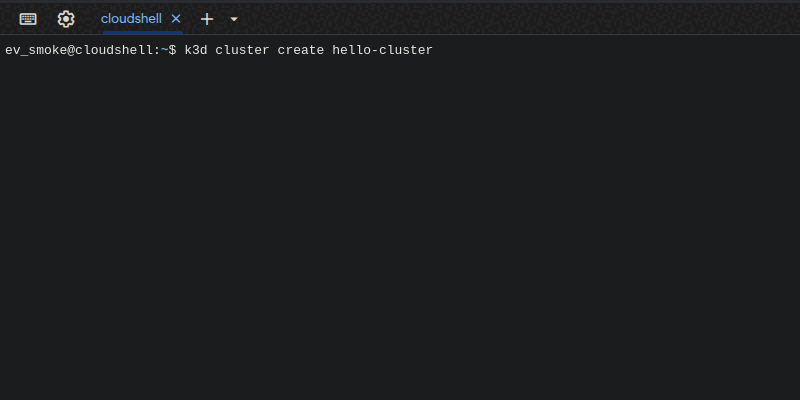

# Порівняння Minikube, kind та k3d

## Вступ: Опис інструментів та їх призначення

Kubernetes є де-факто стандартом для оркестрації контейнерів. Для локального тестування, розробки та PoC-розгортань існують кілька легких рішень:

- **Minikube** — створює одновузловий кластер Kubernetes у віртуальній машині або Docker. Ідеально підходить для розробників.
- **kind (Kubernetes IN Docker)** — запускає кластери Kubernetes всередині контейнерів Docker. Найкращий вибір для CI/CD.
- **k3d** — обгортка для k3s (полегшена версія Kubernetes від Rancher), яка дозволяє запускати його в Docker-контейнерах. Підходить для легких сценаріїв, edge-обчислень.

---

## Характеристики

| Характеристика                   | Minikube                 | kind                      | k3d (з k3s)             |
|----------------------------------|--------------------------|---------------------------|-------------------------|
| **Підтримувані ОС**              | Linux, macOS, Windows    | Linux, macOS, Windows     | Linux, macOS, Windows   |
| **Підтримка архітектур**         | amd64, arm64             | amd64, arm64              | amd64, arm64            |
| **Автоматизація (CI/CD)**        | Обмежена                 | Висока                    | Висока                  |
| **Моніторинг/K8s Dashboard**     | Так (Dashboard вбудовано)| Ні (можна вручну)         | Частково, через k3s     |
| **Інтеграція з Helm**            | Так                      | Так                       | Так                     |
| **Плагіни/розширення**           | Так (драйвери, addons)   | Обмежено (через YAML)     | Обмежено через k3s      |
| **Запуск без Docker Desktop**    | Так                      | Ні                        | Так (через Containerd)  |

---

##  Переваги та недоліки

### Minikube

**Переваги:**
- Повноцінний Kubernetes API.
- Підтримка багатьох драйверів (Docker, VirtualBox, KVM).
- Вбудовані addons, Dashboard, Ingress.

**Недоліки:**
- Важчий, вимагає більше ресурсів.
- Довший час запуску.
- Менш зручний для автоматизації.

---

### kind

**Переваги:**
- Ідеально для CI-пайплайнів.
- Швидкий запуск, мінімальна вага.
- Відмінна підтримка конфігурацій кластерів.

**Недоліки:**
- Неможливо без Docker.
- Менш підходить для інтерактивної розробки.
- Немає GUI-інструментів для керування кластером.

---

### k3d (k3s)

**Переваги:**
- Дуже легкий (k3s < 100MB).
- Швидкий запуск і низьке споживання ресурсів.
- Можна розгортати багатовузлові кластери.

**Недоліки:**
- Полегшений Kubernetes – деякі компоненти вилучені (наприклад, CSI, cloud-controller).
- Менш стандартний підхід (менша сумісність з деякими Kubernetes toolchain).
- Залежність від Rancher (SUSE).

---

## Демонстрація: Hello World на k3d

**Передумови:**
 - `Встановлений k3d: https://k3d.io/#installation`

 - `Встановлений kubectl: https://kubernetes.io/docs/tasks/tools/`




**Кроки:**

1. Створрюємо кластер:
```bash
   k3d cluster create hello-cluster
```

2. Створюємо манифест hello-world.yaml
# hello-world.yaml
```yaml
    apiVersion: v1
    kind: Pod
    metadata:
        name: hello
    spec:
    containers:
        - name: hello
          image: busybox
          command: ['sh', '-c', 'echo Hello from k3d! && sleep 3600']
```
3.  Запустимо манифес
```bash
    kubectl apply -f hello-world.yaml
```

4.  Перевірка логів
```bash
    kubectl logs hello

    Очікуваний результат:
    
    Hello from k3d!
```
5.  Видалення (опціонально)
```bash
    k3d cluster delete hello-cluster
```

Результат
 -  `створили повноцінний Kubernetes кластер локально за 10 секунд.`
 -  `Запустили застосунок без потреби в Docker Desktop чи віртуальних машинах.`
 -  `k3d використовує k3s, тож кластер споживає дуже мало ресурсів — ідеально інтегрується для локальної розробки та PoC.`
