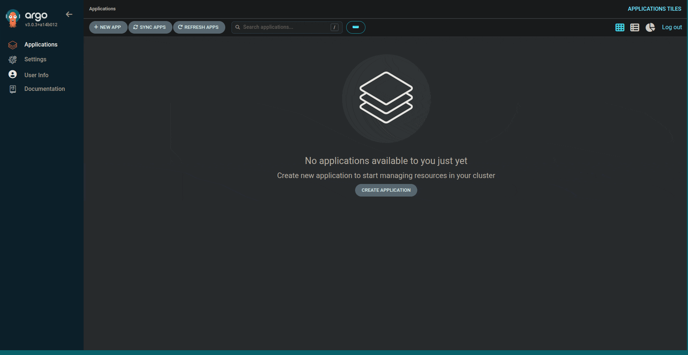
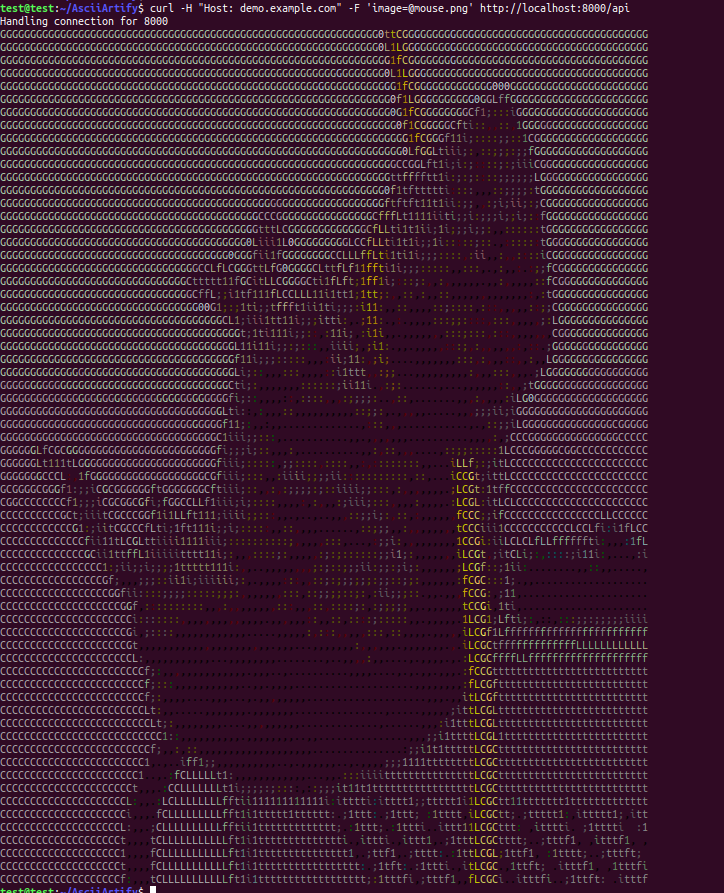

## MVP: Розгортання додатку через ArgoCD

** Мета: розгортання додатку за допомогою argo CD для демонстраціі функціоналу інфраструктури **

Після авторизаціі через веб інтерфейс створюємо новий застосунок з репозітарію, 

Заповнемо форму згідно умов, та підтверджуємо створення.

Перевіряємо створений додаток, та запускаємо сінхронізацію.




## Перевірка працездатності застосунку

Створюємо локальний проксі на порт 8080:

```bash
kubectl port-forward -n demo svc/envoy-demo-eg-0d68e7be 8000:80&
```
потрібний pod дивимось командою:
```bash
kubectl get svc -n demo
```

Надсилаємо тестове зображення

```bash 
curl -H "Host: demo.example.com" -F 'image=@mouse.png' http://localhost:8000/api
```

Отримуємо згенеровану asciart-версію нашого зображенні у відповідь



## В результаті ми отримали
- `інфраструктуру argo CD`
- `працездатний додаток`
- `робочий функціонал Continuous Deployment`


