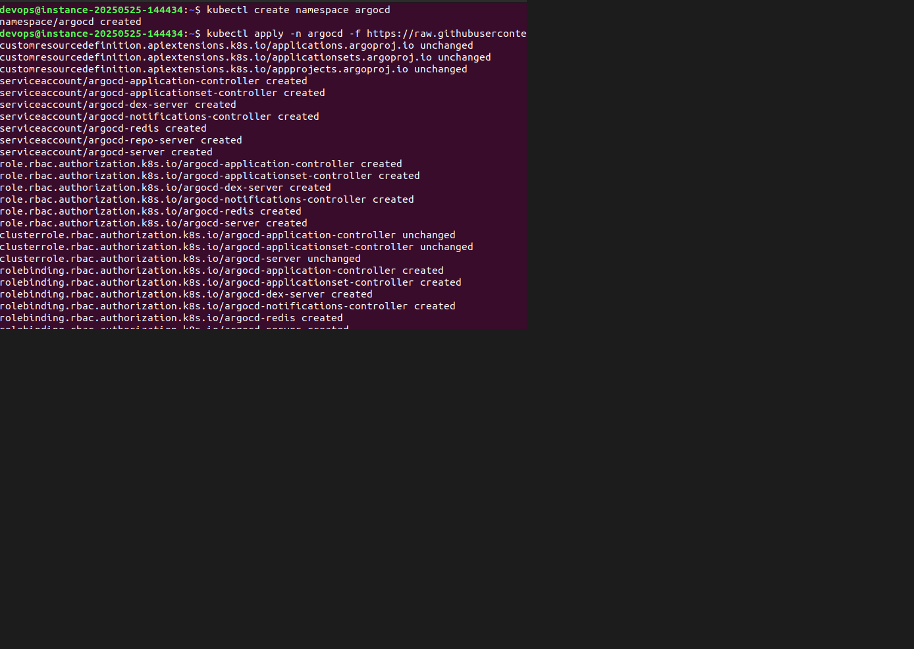

##  PoC: Розгортання Argo CD на k3d з доступом до GUI

Цей PoC демонструє розгортання Argo CD у локальному Kubernetes-кластері, створеному за допомогою k3d, з доступом до веб-інтерфейсу (GUI).

**Вимоги:**
- `Встановлено Docker`
- `Встановлено k3d`
- `Встановлено kubectl`
- `Встановлено Git`

## 1: Створення Kubernetes-кластера

```bash
$ k3d cluster create argo
```
Ця команда створить кластер k3d argo


## 2: Встановлення ArgoCD використовуючи маніфест з офіційного джерела:
```bash
kubectl create namespace argocd
kubectl apply -n argocd -f https://raw.githubusercontent.com/argoproj/argo-cd/stable/manifests/install.yaml
```
Цим ми істалюємо всі компоненти Argo CD у створеному namespace argocd.

## 3: Перевірка статусу компонентів сервісу
 
Перевірка статусу, всі pod-и в статусі Running:
```bash
kubectl get pods -n argocd
```

## 4: Налаштування доступу до графічного інтерфейсу ArgoCD
Створюємо локальний проксі на порт 8080:

```bash
kubectl port-forward svc/argocd-server -n argocd 8080:443
```
**PS: при розгортанні Argo CD в cloud локальний проксі створюємо наступним чином:**

```bash
kubectl port-forward svc/argocd-server -n argocd 8080:443 --address 0.0.0.0
```

Відкриваємо у  браузері:
```
https://<IP-address>:8080
```

## 5: Авторизація в Argo CD
Отримай початковий пароль для користувача admin:

```bash
kubectl -n argocd get secret argocd-initial-admin-secret  -o jsonpath="{.data.password}" | base64 -d && echo
```
Вводимо на сторінці авторизації:
- `Логін: admin`
` ` Пароль: (результат з команди вище)`


## Таким чином ми маємо:



- `Kubernetes кластер (k3d)`

- `Розгорнутий Argo CD`

- `Повний доступ до GUI`


## Посилання

- Офіційна документація Argo CD: https://argo-cd.readthedocs.io/en/stable/
